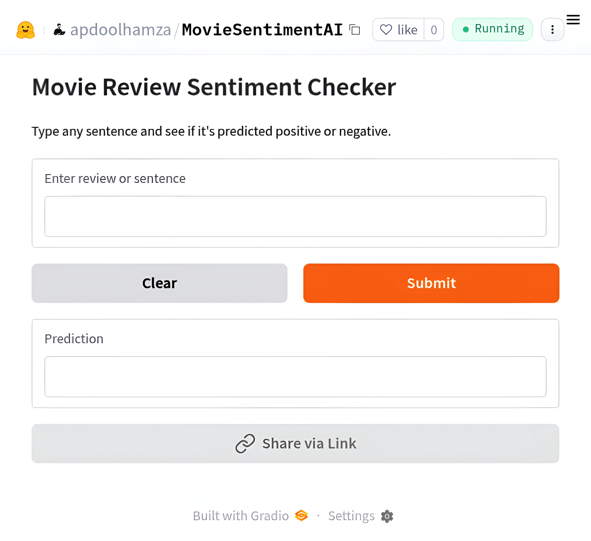

# Movie Review Sentiment Analysis Checker (Production-Oriented NLP Pipeline)

[](https://www.python.org/)
[](https://scikit-learn.org/)
[](https://opensource.org/licenses/MIT)
[](https://colab.research.google.com/drive/1GiN2iebNODvCC12OelqW20n1uiH-NJbr)
[](https://huggingface.co/spaces/apdoolhamza/MovieSentimentAI)

A clean, efficient, and production-ready binary sentiment classifierfor movie reviews using classic machine learning techniques (TF-IDF + LinearSVC + calibration).  
Achieves ~88–90% F1-score on the IMDB 50k dataset while remaining lightweight, explainable, and GPU-free.

<p align="center">
  <a href="https://huggingface.co/spaces/apdoolhamza/MovieSentimentAI">
    
  </a>
</p>

## Features

- Comprehensive EDA with word clouds & length distributions
- TF-IDF with bigrams + sublinear scaling
- Hyperparameter tuning with HalvingGridSearchCV
- Probability calibration (isotonic method)
- Full evaluation suite: classification report, confusion matrix, ROC & PR curves
- Model persistence with joblib
- Quick inference function

## Demo

You can try the model directly in Google Colab:

[](https://colab.research.google.com/drive/1GiN2iebNODvCC12OelqW20n1uiH-NJbr)

Or try live demo:

[](https://huggingface.co/spaces/apdoolhamza/MovieSentimentAI)

## Project Structure

```
movie-sentiment-checker
│
├── Model/
│   └── sentiment_model_calibrated.joblib   # Trained & calibrated ML model
│
├── Notebook/
│   └── Movie review sentiment analysis.ipynb   # Full EDA + Training workflow
│
├── Screenshots/
│   └── (EDA plots, confusion matrix, word clouds, etc.)
│
├── License                 # Project license
├── README.md               # Project documentation
├── app.py                  # Gradio web application
└── requirements.txt        # Project dependencies
```

## Installation

```bash
# Recommended: use a virtual environment
python -m venv venv
source venv/bin/activate          # Linux/macOS
# venv\Scripts\activate           # Windows

# Install dependencies
pip install -r requirements.txt
```

## Quick Start

```python
import joblib

# Load the saved model
model = joblib.load("sentiment_model_calibrated.joblib")

def predict_sentiment(text):
    # The cleaning function is defined in the notebook
    cleaned = clean_text(text)
    proba = model.predict_proba([cleaned])[0][1]
    label = "Positive" if proba > 0.5 else "Negative"
    return label, round(proba, 4)

# Examples
print(predict_sentiment("This movie is absolutely fantastic!"))
print(predict_sentiment("Terrible acting and boring plot. Complete waste."))
```
## Expected output:
```python
('Positive', 0.89102)
('Negative', 0.1125)
```

## 📊 Model Performance (Test Set)

| Metric              | Value                  |
|---------------------|------------------------|
| Accuracy            | 0.9148                 |
| F1-score (macro)    | 0.9148                 |
| ROC-AUC             | 0.9728                 |
| Training time       | 2–8 minutes (CPU)      |
| Inference speed     | < 5 ms / review        |

## License

This project is licensed under the MIT License – see the LICENSE file for details.

## Acknowledgments

* IMDB dataset: [Maas et al., 2011](https://raw.githubusercontent.com/laxmimerit/All-CSV-ML-Data-Files-Download/master/IMDB-Dataset.csv)
* Inspiration & best practices from scikit-learn documentation

## Contact / Contributing

Feel free to open an issue or submit a pull request.

Created by Apdoolmajeed Hamza - [LinkedIn Profile](https://www.linkedin.com/in/apdoolhamza/) 

Last updated: February 2026

